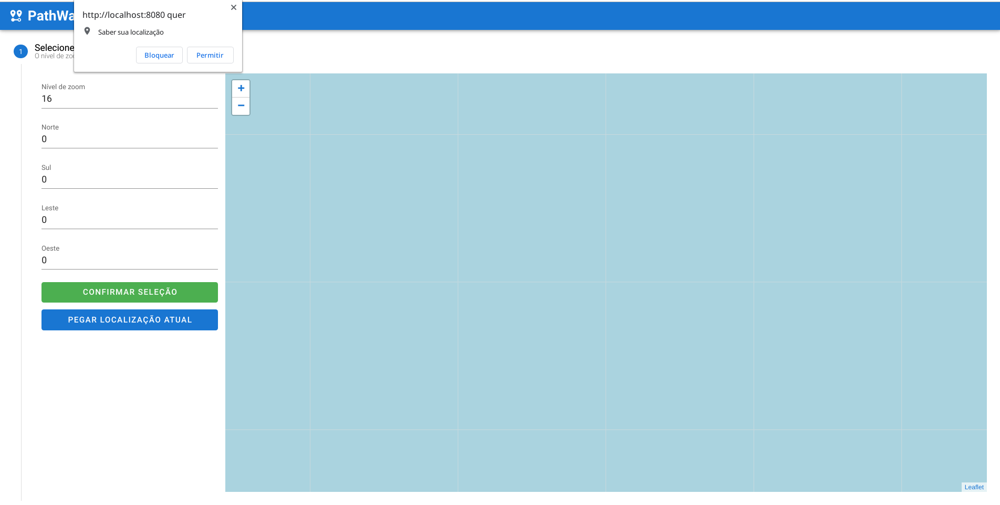
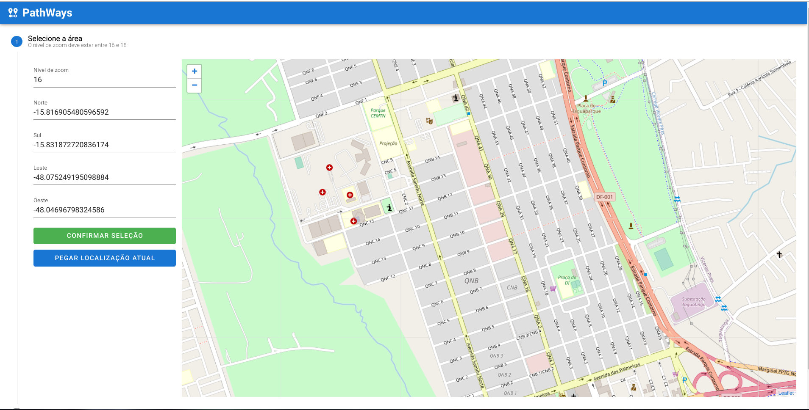
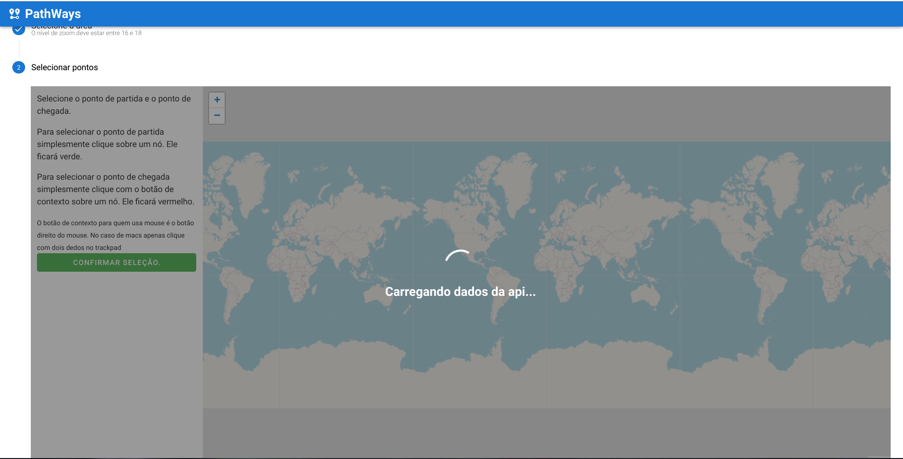
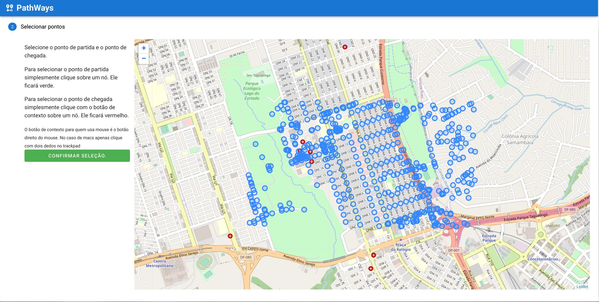
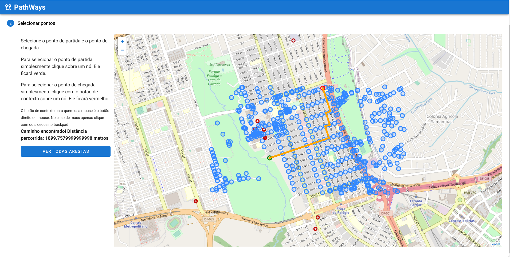
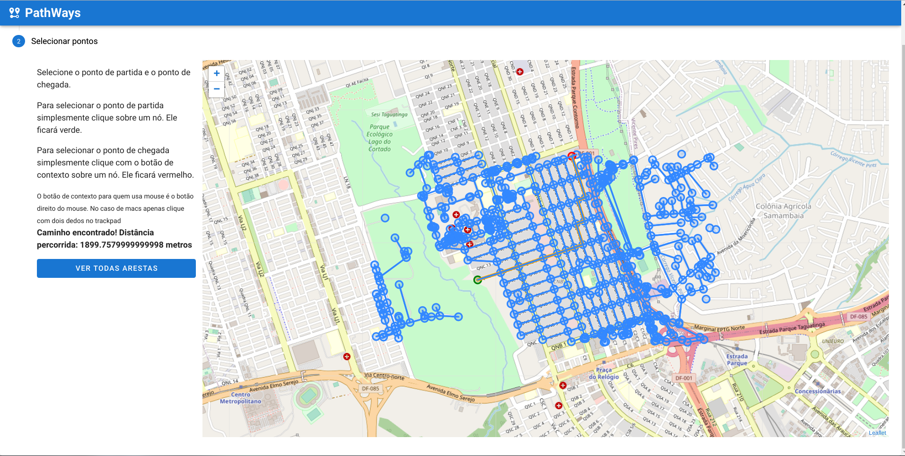
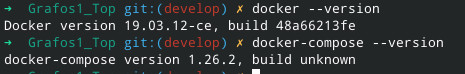
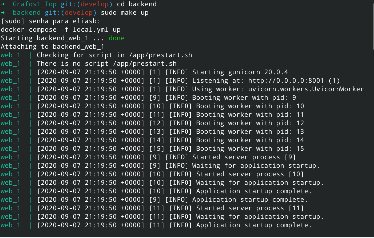

# PathWays

**Conteúdo da Disciplina**: Grafos 2 

Temas:
 - Grafos2
 
 
## Alunos
|Matrícula | Aluno | Github |
| -- | -- | -- |
| 15/0009011 |  Elias Bernardo | @ebmm01 |
| 17/0141161 |  Erick Giffoni | @ErickGiffoni |

## Sobre 

O projeto PathWays permite que você encontre o menor caminho entre dois pontos numa região do mapa.

O usuário pode selecionar sua posição atual com base nas api's de geolocalização do navegador ou selecionar manualmente qualquer região no globo.

**Backend**: 
    - Linguagem: Python 
    - Framework: [FastAPI](https://fastapi.tiangolo.com/) 
    - Bibliotecas: [Osmnx](https://osmnx.readthedocs.io/en/stable/index.html) 

**Frontend**: 
    - Linguagem: Javascript 
    - Framework: [VueJs](https://vuejs.org/) 
    - Bibliotecas: [LeafletJs](https://leafletjs.com/) 

<<<<<<< HEAD

## Screenshots

=======
>>>>>>> 9e99401478d528ede2a6f8b4c35a735ff7c033bb

## Screenshots

## Instalação 

### Requisitos para utilizar esse projeto

- conexão de internet; 
- navegador web de escolha livre (__não usar o safari__); 
- terminal/console/shell no computador; 
- npm; 
- docker & docker-compose; 
- clonar o projeto;

> Para clonar o projeto digite:

    git clone https://github.com/projeto-de-algoritmos/Grafos2_Pathways

### Instalando o backend

Tenha a certeza de ter o [docker](https://docs.docker.com/get-docker/) e o [docker compose](https://docs.docker.com/compose/) instalados e em execução. Você pode verificar a instalação de ambos com os seguintes comandos:

    docker --version

E 

    docker-compose --version

Caso ambos estejam corretamente instalados você deve obter uma saída parecida com:

> Note que a sua versão pode ser diferente da exibida abaixo.

Na sequência, considerando que você está na raiz do projeto, digite

    cd backend/

Para ir até a pasta do backend, e na sequência inicie a API com o comando

    (sudo) make up

> O sudo é opcional a depender de como você configurou o docker.

Caso nenhum erro ocorra você terá uma tela parecida com a abaixo:

### Instalando o frontend

Para o front é necessário ter instalado o [node & npm](https://nodejs.org/en/).

Caso você esteja na raiz do projeto vá até a pasta do front-end digitando num terminal:

    cd frontend

E instale as dependências necessárias com o comando:

    npm install

Após a instalação das dependências inicie o projeto:

    npm run serve

Caso tudo ocorra com sucesso você terá uma tela parecida com a abaixo:

## Uso

Antes de usar, faça a [instalação](#Instalação) do projeto.

Você pode assistir o vídeo a seguir para entender como utilizar
o projeto.

- Download na pasta `images/Como usar o projeto .mp4` ou
- Assista pelo YouTube: TODO

1. Abra o navegador web de sua escolha; 
2. Digite na barra de busca o endereço informado pelo frontend (por padrão `http://localhost:8080/` caso você não tenha nenhuma outra aplicação utilizando essa porta);
3. Escolha uma região no globo ou, opcionalmente, use a sua localização atual (requer permissões de localização no navegador)
4. Coloque o zoom entre 16 e 18.
5. Após confirmar a região clique em "Confirmar seleção" e aguarde o carregamento dos dados.
6. Selecione os nós de inicio e fim conforme instruções no canto esquerdo da tela (você verá no navegador).
7. Clique em "Confirmar seleção" e aguarde o processamento. Caso haja um caminho entre os nós selecionados ele será exibido. Do contrário você receberá um alerta dizendo que não há caminho entre os nós escolhidos e você poderá selecionar outros nós.
8. Após o caminho ser desenhado será exibida a informação com a distância entre nós e você poderá ver todas as arestas da região selecionada.

## Problemas ? Sugestões ?

Caso você tenha alguma dificuldade, sugestão ou algum problema com o projeto, 
por favor entre em contato conosco:

- Elias Bernardo - ebmm01@gmail.com - telegram @ebmm01
- Erick Giffoni - giffoni.erick@gmail.com - telegram @ErickGiffoni 

